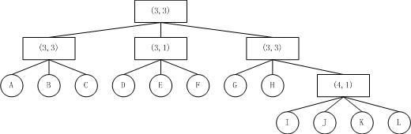

## 基于属性加密（Attribute-Based Encryption，ABE）

##### 1 基于身份加密（IBE）

##### 2 ABE

- 基于属性加密(Attribute-Based Encryption，ABE)是基于身份加密(Identity-Based Encryption)的扩展。Sahai和Waters在[ABE开山之作](Sahai A., Waters B.: Fuzzy identity-based encryption. EUROCRYPT 2005. Springer Berlin Heidelberg, (2005) 568-588)首先定义了ABE，他们指出在ABE中:
  - 加密的文件被一个属性集合所标识，里面包含n个属性，每个属性用一个有意义的字符串来描述（如：某个大学或机构的名称、文档等级等）；
  - 用户的私钥也被一个属性集合所标识，里面包含m个属性，每个属性同样用有意义的字符串来描述；

- 解密时，方案会自动对私钥属性集合和密文属性集合作交集，如果属性交集的个数大于等于某个阈值t，则可以解密成功。举个例子，加密文件对应的属性集合为，阈值t设置为2。
  - 某个老师拥有的属性集合为，我们有，则这个老师就可以用其私钥解密文档。
  - 某个学生拥有的属性集合为，我们有，则这个学生也可以用其私钥解密文档。
  - 某个学生拥有的属性集合为，我们有，则这个老师就不能用其私钥解密文档。
- ABE是基于属性的加密，加密的文件会被一些属性给标识，一个AA负责发出私钥给用户。一个用户向AA申请私有秘钥，私有秘钥包含（用户拥有的属性和一个秘钥）。所以ABE解密数据的过程包括两个部分：
  - 验证属
  - 解密被加密的数据
- 随后ABE朝着两个方向发展：KP-ABE和CP-ABE。
  - KP-ABE
    - 加密数据：数据包括被加密的数据和***数据拥有者所要求标识的属性***
    - 秘钥：包括属于申请者的***一个访问策略***和一个秘钥
    - 数据拥有者（DO）-->加密数据，数据包含***被加密的数据***和***DO所要求标识的attributes***
    - 数据请求者向AA申请自己的私钥
    - 当数据请求者私钥的***访问策略***和加密数据***标识的属性***match后满足
    - 请求者可以解密数据
  - CP-ABE
    - 加密数据：数据包括被加密的数据和***一个访问策略***
    - 秘钥：包括属于申请者***所拥有的属性集***和一个秘钥
    - 数据拥有者（DO）-->加密数据，数据包含***被加密的数据***和***访问策略***
    - 数据请求者向AA申请自己的私钥
    - 当数据请求者私钥的***属性集***和加密数据的***访问策略***match后满足
    - 请求者可以解密数据

##### 3 访问控制树

- Goyal，Pandey，Sahai和Waters真正实现了支持访问控制政策的ABE方案[4]。他们将访问控制政策描述为树（Access Tree）的形式：

  - 

    上图中，每个叶子节点都是一个属性，非叶子节点为一个门限节点（Threshold Gate/Node），里面的数据形式为(n, t)，表示：此节点一共有n个子节点，只要有t个子节点满足条件，那么此节点也满足条件。解密时，只要属性集合使得访问控制树的根节点满足条件，就可以正确解密。

  - 访问控制树带来了极为方便的访问控制描述形式，其直接覆盖了所谓单调布尔代数访问控制政策（Montone Boolean Formula）的描述形式：对于AND，其门限节点形式为(n, n)；对于OR，其门限节点形式为(n, 1)。举个例子，对于访问控制政策

    ***(A and B and C) and (D or E or F) and (G and H and (I or J or K or L))***

    其对应的访问控制树为：

    

  - 访问控制树应该放在哪里呢？

    Goyal等人指出，如果私钥用访问控制树标识，加密文件用属性集合标识，此种ABE称为私钥策略ABE（Key-Policy ABE，KP-ABE）；反之，如果私钥用属性集合标识，加密文件用访问控制树标识，此种ABE称为密文策略ABE（Ciphertext-Policy ABE，CP-ABE）。

  - 

  - 

##### 4 访问控制策略

- Let  be a set of parties. A collection  is monotone if for any  and : if  and  then . An access structure (respectively, monotone access structure) is a collection (respectively, monotone collection)  of non-empty subsets of , i.e., . The sets in  are called the authorized sets, and the sets not in  are called the unauthorized sets.

##### 5 

